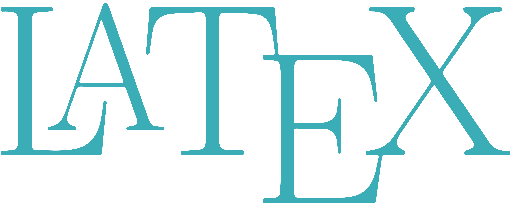

# $\LaTeX$ minicurso
14ª Semana da Física da Universidade Federal de Uberlândia

Agosto, 2025

  

### O que é o $\LaTeX$? 
$\LaTeX$ é uma linguagem de formatação de textos, especialmente popular para trabalhos científicos. Ele permite a produção de documentos com alta qualidade tipográfica, especialmente para expressões matemáticas. O $\LaTeX$ utiliza comandos para formatar o texto, ao contrário de editores WYSIWYG (o que você vê é o que você obtém), como o Word.

**Vantagens:** 
1. Qualidade tipográfica;
2. Foco no conteúdo;
3. Edição de fórmulas;
4. Facilidade na geração de referências e bibliografias;
5. Padronização;
6. Gratuito e de código aberto;

### O que veremos aqui? 
1. Estrutura básica de um documento: _documentclasses_, pacotes e configurações iniciais;
2. Inserção de imagens, tabelas e equações;
3. Formatação das referencias bibliográficas;
4. Apresentação do TikZ e do PGFPlots e aplicações na Física;

# O Overleaf

  

